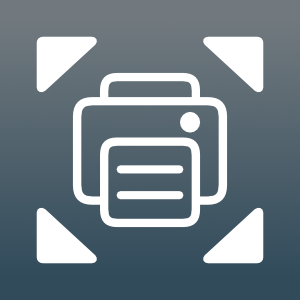

 

# PDF Print Scaler

PDF Print Scaler is an iOS app and [action extension](https://developer.apple.com/library/archive/documentation/General/Conceptual/ExtensibilityPG/Action.html) that scales and prints a PDF.  Scaling is not the same as resizing. The original paper size is preserved; only the content is scaled. Thus, for a scale greater than 100%, some of the content will be cropped. For a scale less than 100%, the content will be padded with additional white space. This emulates the "Scale" option in the MacOS print dialog. This option is missing on iOS and iPadOS. This app allows you to adjust the margins on a PDF when you don't own the source from which the PDF was generated.

### Installation

The app can be downloaded for free from the Apple [App Store](https://apps.apple.com/us/app/id6670455978/). There are no in-app purchases or ads.

### Privacy

This app does not collect or share any personal information. For complete details, read the [Privacy Policy](https://stephenbensley.github.io/PdfPrintScaler/privacy.html)

### License

The source code for this app has been released under the [MIT License](LICENSE).

### Copyright

© 2024 Stephen E. Bensley

## Building from Source

The app was developed with [Xcode](https://developer.apple.com/xcode/), which is freely available from Apple. After installing Xcode and cloning the repo, open the Xcode [project](PdfPrintScaler.xcodeproj) at the root of the repo. The Git tags correspond to App Store releases. Checkout the most recent tag to ensure a stable build.

### Dependencies

The app depends on one Swift Packages (developed by me): [UtiliKit](https://github.com/stephenbensley/UtiliKit). This should be resolved automatically when you open and build the project.

### Targets

The Xcode project has the following targets:

- PdfPrintScaler: The iOS app
- PrintScaled: The iOS action extension
